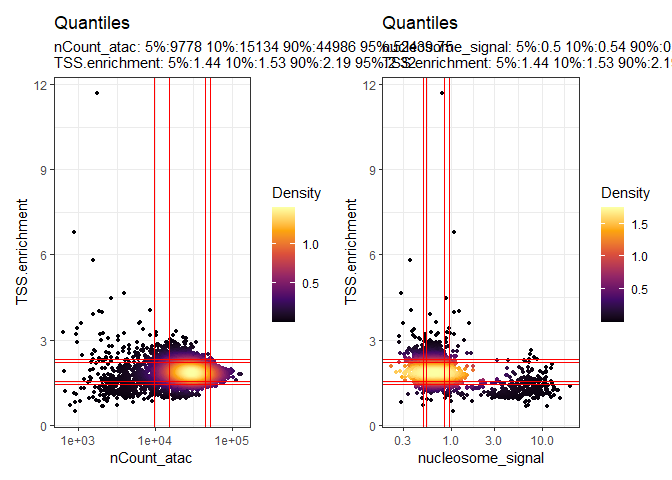
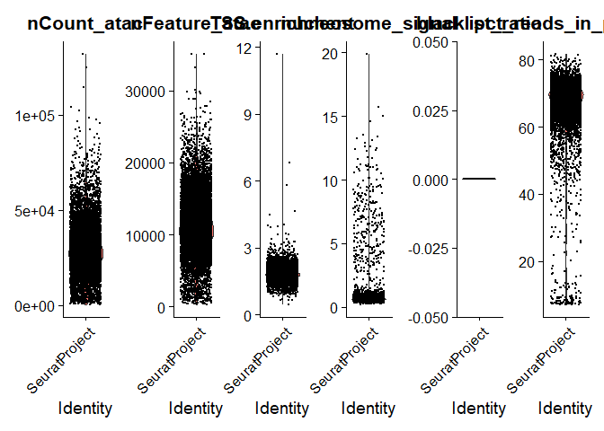
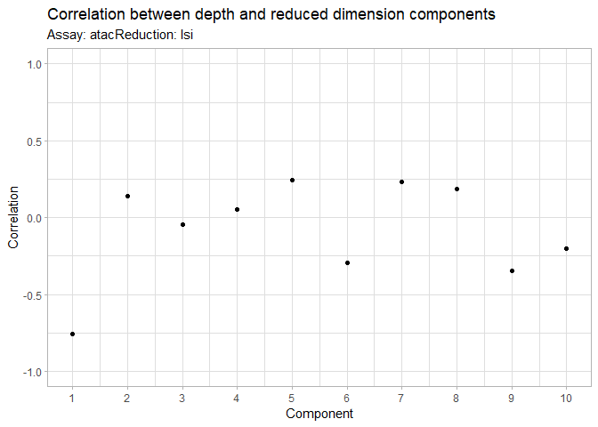
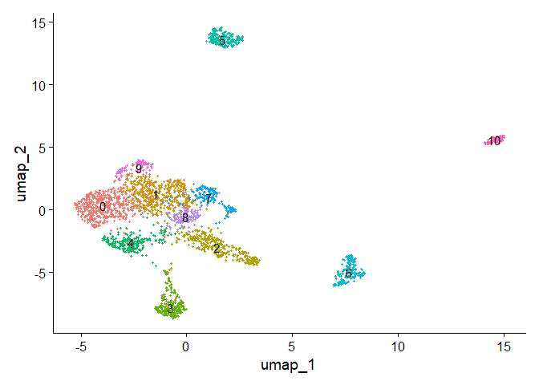
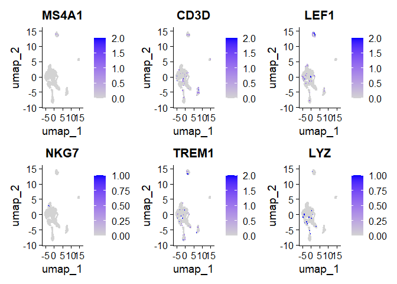
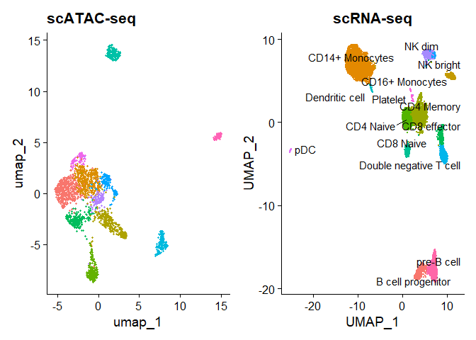
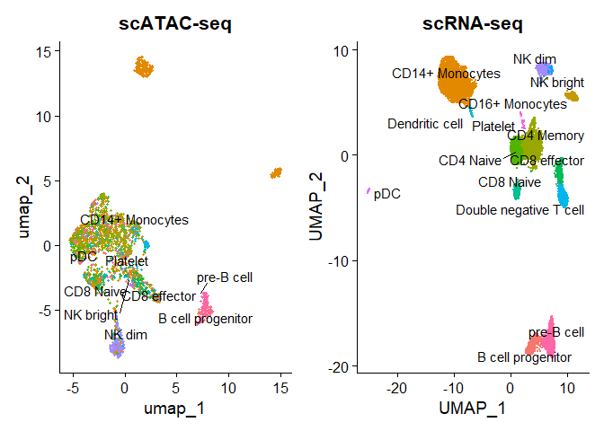
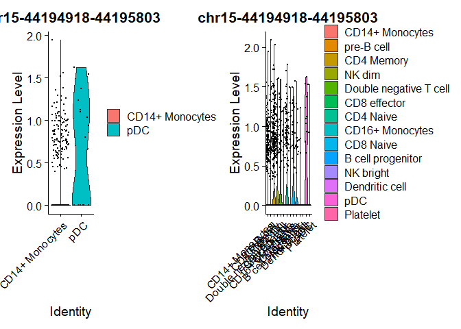
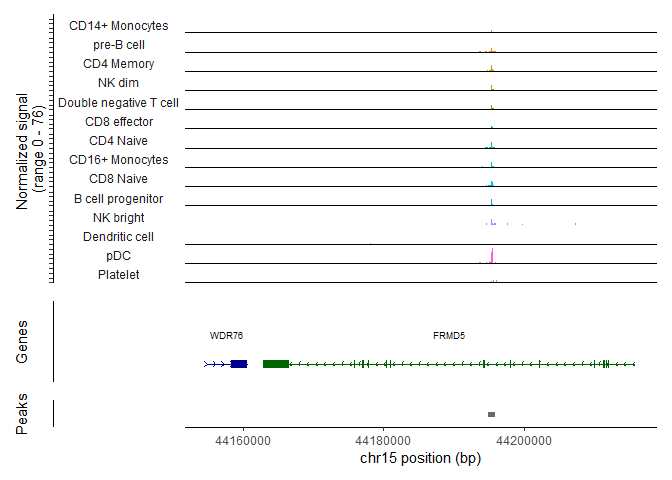

scATAC-seq Workflow (Signac)
================
Layaa Sivakumar
2025-09-20

## Data

Using dataset specified in the Signac vignette:

    wget https://cf.10xgenomics.com/samples/cell-atac/2.1.0/10k_pbmc_ATACv2_nextgem_Chromium_Controller/10k_pbmc_ATACv2_nextgem_Chromium_Controller_filtered_peak_bc_matrix.h5
    wget https://cf.10xgenomics.com/samples/cell-atac/2.1.0/10k_pbmc_ATACv2_nextgem_Chromium_Controller/10k_pbmc_ATACv2_nextgem_Chromium_Controller_singlecell.csv
    wget https://cf.10xgenomics.com/samples/cell-atac/2.1.0/10k_pbmc_ATACv2_nextgem_Chromium_Controller/10k_pbmc_ATACv2_nextgem_Chromium_Controller_fragments.tsv.gz
    wget https://cf.10xgenomics.com/samples/cell-atac/2.1.0/10k_pbmc_ATACv2_nextgem_Chromium_Controller/10k_pbmc_ATACv2_nextgem_Chromium_Controller_fragments.tsv.gz.tbi

``` r
library(Signac)
library(Seurat)
library(tidyverse)
library(EnsDb.Hsapiens.v75)
```

``` r
path = "C:\\Users\\layaa\\Documents\\2025\\professional-dev\\signac-vignette-data"
```

## What is a fragment file? How is it generated?

``` r
frag.file = read.delim(file.path(path, "10k_pbmc_ATACv2_nextgem_Chromium_Controller_fragments.tsv.gz"), header=F, nrow=10)
head(frag.file)
```

    ##                                                 V1
    ## 1 # id=10k_pbmc_ATACv2_nextgem_Chromium_Controller
    ## 2                        # description=Human PBMCs
    ## 3                                                #
    ## 4                  # pipeline_name=cellranger-atac
    ## 5         # pipeline_version=cellranger-atac-2.1.0
    ## 6                                                #

## Load data

``` r
counts = Read10X_h5(filename = file.path(path, "10k_pbmc_ATACv2_nextgem_Chromium_Controller_filtered_peak_bc_matrix.h5"))
counts[1:10, 1:10]
```

    ## 10 x 10 sparse Matrix of class "dgCMatrix"

    ##   [[ suppressing 10 column names 'AAACGAAAGAGAGGTA-1', 'AAACGAAAGCAGGAGG-1', 'AAACGAAAGGAAGAAC-1' ... ]]

    ##                                       
    ## chr1:9772-10660    . . . . . . . . . .
    ## chr1:180712-181178 . . . . . . . . . .
    ## chr1:181200-181607 . . . . . . . . . .
    ## chr1:191183-192084 . . . . . . . . . .
    ## chr1:267576-268461 . . . . . . . . . .
    ## chr1:270850-271755 . . . . . . . . . .
    ## chr1:273946-274792 . . . . . . . . . .
    ## chr1:585753-586648 . . . . . . . . . .
    ## chr1:605079-605959 . . . . . . . . . .
    ## chr1:629538-630397 . . . . . . . . 2 .

This is a sparse matrix–only non-zero values are stored. Here, the
features are the regions of predicted open chromatin (peaks). The number
in the matrix represent the number of Tn5 integration sites that map to
each chromatic region in each cell.

Let’s create a ChromatinAssay object using the counts data now, we will
set the `min.cells=10` (includes only those features that are detected
in at least 10 cells) and `min.features=200` (includes only those cells
with at least 200 features detected).

``` r
chrom_assay <- CreateChromatinAssay(
  counts = counts,
  sep = c(":", "-"),
  fragments = file.path(path, "10k_pbmc_ATACv2_nextgem_Chromium_Controller_fragments.tsv.gz"),
  min.cells = 10,
  min.features = 200
)
```

    ## Computing hash

``` r
str(chrom_assay)
```

    ## Formal class 'ChromatinAssay' [package "Signac"] with 16 slots
    ##   ..@ ranges            :Formal class 'GRanges' [package "GenomicRanges"] with 7 slots
    ##   .. .. ..@ seqnames       :Formal class 'Rle' [package "S4Vectors"] with 4 slots
    ##   .. .. .. .. ..@ values         : Factor w/ 35 levels "chr1","chr2",..: 1 10 11 12 13 14 15 16 17 18 ...
    ##   .. .. .. .. ..@ lengths        : int [1:35] 15868 7958 7791 8494 4196 5442 5358 5235 7519 3407 ...
    ##   .. .. .. .. ..@ elementMetadata: NULL
    ##   .. .. .. .. ..@ metadata       : list()
    ##   .. .. ..@ ranges         :Formal class 'IRanges' [package "IRanges"] with 6 slots
    ##   .. .. .. .. ..@ start          : int [1:165434] 9772 180712 181200 191183 267576 270850 273946 585753 605079 629538 ...
    ##   .. .. .. .. ..@ width          : int [1:165434] 889 467 408 902 886 906 847 896 881 860 ...
    ##   .. .. .. .. ..@ NAMES          : NULL
    ##   .. .. .. .. ..@ elementType    : chr "ANY"
    ##   .. .. .. .. ..@ elementMetadata: NULL
    ##   .. .. .. .. ..@ metadata       : list()
    ##   .. .. ..@ strand         :Formal class 'Rle' [package "S4Vectors"] with 4 slots
    ##   .. .. .. .. ..@ values         : Factor w/ 3 levels "+","-","*": 3
    ##   .. .. .. .. ..@ lengths        : int 165434
    ##   .. .. .. .. ..@ elementMetadata: NULL
    ##   .. .. .. .. ..@ metadata       : list()
    ##   .. .. ..@ seqinfo        :Formal class 'Seqinfo' [package "GenomeInfoDb"] with 4 slots
    ##   .. .. .. .. ..@ seqnames   : chr [1:35] "chr1" "chr2" "chr3" "chr4" ...
    ##   .. .. .. .. ..@ seqlengths : int [1:35] NA NA NA NA NA NA NA NA NA NA ...
    ##   .. .. .. .. ..@ is_circular: logi [1:35] NA NA NA NA NA NA ...
    ##   .. .. .. .. ..@ genome     : chr [1:35] NA NA NA NA ...
    ##   .. .. ..@ elementMetadata:Formal class 'DFrame' [package "S4Vectors"] with 6 slots
    ##   .. .. .. .. ..@ rownames       : NULL
    ##   .. .. .. .. ..@ nrows          : int 165434
    ##   .. .. .. .. ..@ elementType    : chr "ANY"
    ##   .. .. .. .. ..@ elementMetadata: NULL
    ##   .. .. .. .. ..@ metadata       : list()
    ##   .. .. .. .. ..@ listData       : Named list()
    ##   .. .. ..@ elementType    : chr "ANY"
    ##   .. .. ..@ metadata       : list()
    ##   ..@ motifs            : NULL
    ##   ..@ fragments         :List of 1
    ##   .. ..$ :Formal class 'Fragment' [package "Signac"] with 3 slots
    ##   .. .. .. ..@ path : chr "C:\\Users\\layaa\\Documents\\2025\\professional-dev\\signac-vignette-data\\10k_pbmc_ATACv2_nextgem_Chromium_Con"| __truncated__
    ##   .. .. .. ..@ hash : chr [1:2] "772c3330f03fd0ba3a6dbb6bda3f3cad" "6ced7825c817dda059600e70be27f466"
    ##   .. .. .. ..@ cells: Named chr [1:10246] "AAACGAAAGAGAGGTA-1" "AAACGAAAGCAGGAGG-1" "AAACGAAAGGAAGAAC-1" "AAACGAAAGTCGACCC-1" ...
    ##   .. .. .. .. ..- attr(*, "names")= chr [1:10246] "AAACGAAAGAGAGGTA-1" "AAACGAAAGCAGGAGG-1" "AAACGAAAGGAAGAAC-1" "AAACGAAAGTCGACCC-1" ...
    ##   ..@ seqinfo           : NULL
    ##   ..@ annotation        : NULL
    ##   ..@ bias              : NULL
    ##   ..@ positionEnrichment: list()
    ##   ..@ links             :Formal class 'GRanges' [package "GenomicRanges"] with 7 slots
    ##   .. .. ..@ seqnames       :Formal class 'Rle' [package "S4Vectors"] with 4 slots
    ##   .. .. .. .. ..@ values         : Factor w/ 0 levels: 
    ##   .. .. .. .. ..@ lengths        : int(0) 
    ##   .. .. .. .. ..@ elementMetadata: NULL
    ##   .. .. .. .. ..@ metadata       : list()
    ##   .. .. ..@ ranges         :Formal class 'IRanges' [package "IRanges"] with 6 slots
    ##   .. .. .. .. ..@ start          : int(0) 
    ##   .. .. .. .. ..@ width          : int(0) 
    ##   .. .. .. .. ..@ NAMES          : NULL
    ##   .. .. .. .. ..@ elementType    : chr "ANY"
    ##   .. .. .. .. ..@ elementMetadata: NULL
    ##   .. .. .. .. ..@ metadata       : list()
    ##   .. .. ..@ strand         :Formal class 'Rle' [package "S4Vectors"] with 4 slots
    ##   .. .. .. .. ..@ values         : Factor w/ 3 levels "+","-","*": 
    ##   .. .. .. .. ..@ lengths        : int(0) 
    ##   .. .. .. .. ..@ elementMetadata: NULL
    ##   .. .. .. .. ..@ metadata       : list()
    ##   .. .. ..@ seqinfo        :Formal class 'Seqinfo' [package "GenomeInfoDb"] with 4 slots
    ##   .. .. .. .. ..@ seqnames   : chr(0) 
    ##   .. .. .. .. ..@ seqlengths : int(0) 
    ##   .. .. .. .. ..@ is_circular: logi(0) 
    ##   .. .. .. .. ..@ genome     : chr(0) 
    ##   .. .. ..@ elementMetadata:Formal class 'DFrame' [package "S4Vectors"] with 6 slots
    ##   .. .. .. .. ..@ rownames       : NULL
    ##   .. .. .. .. ..@ nrows          : int 0
    ##   .. .. .. .. ..@ elementType    : chr "ANY"
    ##   .. .. .. .. ..@ elementMetadata: NULL
    ##   .. .. .. .. ..@ metadata       : list()
    ##   .. .. .. .. ..@ listData       : Named list()
    ##   .. .. ..@ elementType    : chr "ANY"
    ##   .. .. ..@ metadata       : list()
    ##   ..@ counts            :Formal class 'dgCMatrix' [package "Matrix"] with 6 slots
    ##   .. .. ..@ i       : int [1:115807238] 14 37 40 86 98 99 110 113 115 122 ...
    ##   .. .. ..@ p       : int [1:10247] 0 12605 17997 31303 45352 52467 66981 91458 102075 112905 ...
    ##   .. .. ..@ Dim     : int [1:2] 165434 10246
    ##   .. .. ..@ Dimnames:List of 2
    ##   .. .. .. ..$ : chr [1:165434] "chr1-9772-10660" "chr1-180712-181178" "chr1-181200-181607" "chr1-191183-192084" ...
    ##   .. .. .. ..$ : chr [1:10246] "AAACGAAAGAGAGGTA-1" "AAACGAAAGCAGGAGG-1" "AAACGAAAGGAAGAAC-1" "AAACGAAAGTCGACCC-1" ...
    ##   .. .. ..@ x       : num [1:115807238] 2 2 2 2 2 2 2 2 2 2 ...
    ##   .. .. ..@ factors : list()
    ##   ..@ data              :Formal class 'dgCMatrix' [package "Matrix"] with 6 slots
    ##   .. .. ..@ i       : int [1:115807238] 14 37 40 86 98 99 110 113 115 122 ...
    ##   .. .. ..@ p       : int [1:10247] 0 12605 17997 31303 45352 52467 66981 91458 102075 112905 ...
    ##   .. .. ..@ Dim     : int [1:2] 165434 10246
    ##   .. .. ..@ Dimnames:List of 2
    ##   .. .. .. ..$ : chr [1:165434] "chr1-9772-10660" "chr1-180712-181178" "chr1-181200-181607" "chr1-191183-192084" ...
    ##   .. .. .. ..$ : chr [1:10246] "AAACGAAAGAGAGGTA-1" "AAACGAAAGCAGGAGG-1" "AAACGAAAGGAAGAAC-1" "AAACGAAAGTCGACCC-1" ...
    ##   .. .. ..@ x       : num [1:115807238] 2 2 2 2 2 2 2 2 2 2 ...
    ##   .. .. ..@ factors : list()
    ##   ..@ scale.data        : num[0 , 0 ] 
    ##   ..@ assay.orig        : NULL
    ##   ..@ var.features      : logi(0) 
    ##   ..@ meta.features     :'data.frame':   165434 obs. of  0 variables
    ##   ..@ misc              :List of 1
    ##   .. ..$ calcN: logi TRUE
    ##   ..@ key               : chr ""

``` r
metadata <- read.csv(
  file = file.path(path, "10k_pbmc_ATACv2_nextgem_Chromium_Controller_singlecell.csv"),
  header = T,
  row.names = 1
  )
head(metadata)
```

    ##                       total duplicate chimeric unmapped lowmapq mitochondrial nonprimary passed_filters is__cell_barcode excluded_reason TSS_fragments
    ## NO_BARCODE         20081988   3972351     3423  2118408 1159348         23059       4131       12801268                0               0             0
    ## AAACGAAAGAAACGCC-1        4         0        0        0       0             0          0              4                0               0             1
    ## AAACGAAAGAAAGCAG-1        3         0        0        0       0             0          0              3                0               0             0
    ## AAACGAAAGAAAGGGT-1        2         0        0        0       0             0          0              2                0               0             0
    ## AAACGAAAGAAATACC-1       17         0        0        0       0             0          0             17                0               0            11
    ## AAACGAAAGAAATCTG-1        1         0        0        0       0             0          0              1                0               2             0
    ##                    DNase_sensitive_region_fragments enhancer_region_fragments promoter_region_fragments on_target_fragments blacklist_region_fragments
    ## NO_BARCODE                                        0                         0                         0                   0                          0
    ## AAACGAAAGAAACGCC-1                                0                         0                         0                   1                          0
    ## AAACGAAAGAAAGCAG-1                                0                         0                         0                   0                          0
    ## AAACGAAAGAAAGGGT-1                                0                         0                         0                   0                          0
    ## AAACGAAAGAAATACC-1                                0                         0                         0                  11                          0
    ## AAACGAAAGAAATCTG-1                                0                         0                         0                   0                          0
    ##                    peak_region_fragments peak_region_cutsites
    ## NO_BARCODE                             0                    0
    ## AAACGAAAGAAACGCC-1                     2                    4
    ## AAACGAAAGAAAGCAG-1                     1                    2
    ## AAACGAAAGAAAGGGT-1                     1                    2
    ## AAACGAAAGAAATACC-1                    14                   27
    ## AAACGAAAGAAATCTG-1                     0                    0

The metadata shows the number of reads in each of the cells that are
duplicated, chimeric, unmapped, in different regions of the chromatin,
etc. Some of these values will be used in the QC that we will perform in
this workflow. In this dataset, this metadata file was generated with
CellRanger, but if not provided, it can also be generated using the
Signac package (see full vignette).

``` r
pbmc <- CreateSeuratObject(
  counts = chrom_assay,
  assay = "atac",
  meta.data = metadata
)

str(pbmc)
```

    ## Formal class 'Seurat' [package "SeuratObject"] with 13 slots
    ##   ..@ assays      :List of 1
    ##   .. ..$ atac:Formal class 'ChromatinAssay' [package "Signac"] with 16 slots
    ##   .. .. .. ..@ ranges            :Formal class 'GRanges' [package "GenomicRanges"] with 7 slots
    ##   .. .. .. .. .. ..@ seqnames       :Formal class 'Rle' [package "S4Vectors"] with 4 slots
    ##   .. .. .. .. .. .. .. ..@ values         : Factor w/ 35 levels "chr1","chr2",..: 1 10 11 12 13 14 15 16 17 18 ...
    ##   .. .. .. .. .. .. .. ..@ lengths        : int [1:35] 15868 7958 7791 8494 4196 5442 5358 5235 7519 3407 ...
    ##   .. .. .. .. .. .. .. ..@ elementMetadata: NULL
    ##   .. .. .. .. .. .. .. ..@ metadata       : list()
    ##   .. .. .. .. .. ..@ ranges         :Formal class 'IRanges' [package "IRanges"] with 6 slots
    ##   .. .. .. .. .. .. .. ..@ start          : int [1:165434] 9772 180712 181200 191183 267576 270850 273946 585753 605079 629538 ...
    ##   .. .. .. .. .. .. .. ..@ width          : int [1:165434] 889 467 408 902 886 906 847 896 881 860 ...
    ##   .. .. .. .. .. .. .. ..@ NAMES          : NULL
    ##   .. .. .. .. .. .. .. ..@ elementType    : chr "ANY"
    ##   .. .. .. .. .. .. .. ..@ elementMetadata: NULL
    ##   .. .. .. .. .. .. .. ..@ metadata       : list()
    ##   .. .. .. .. .. ..@ strand         :Formal class 'Rle' [package "S4Vectors"] with 4 slots
    ##   .. .. .. .. .. .. .. ..@ values         : Factor w/ 3 levels "+","-","*": 3
    ##   .. .. .. .. .. .. .. ..@ lengths        : int 165434
    ##   .. .. .. .. .. .. .. ..@ elementMetadata: NULL
    ##   .. .. .. .. .. .. .. ..@ metadata       : list()
    ##   .. .. .. .. .. ..@ seqinfo        :Formal class 'Seqinfo' [package "GenomeInfoDb"] with 4 slots
    ##   .. .. .. .. .. .. .. ..@ seqnames   : chr [1:35] "chr1" "chr2" "chr3" "chr4" ...
    ##   .. .. .. .. .. .. .. ..@ seqlengths : int [1:35] NA NA NA NA NA NA NA NA NA NA ...
    ##   .. .. .. .. .. .. .. ..@ is_circular: logi [1:35] NA NA NA NA NA NA ...
    ##   .. .. .. .. .. .. .. ..@ genome     : chr [1:35] NA NA NA NA ...
    ##   .. .. .. .. .. ..@ elementMetadata:Formal class 'DFrame' [package "S4Vectors"] with 6 slots
    ##   .. .. .. .. .. .. .. ..@ rownames       : NULL
    ##   .. .. .. .. .. .. .. ..@ nrows          : int 165434
    ##   .. .. .. .. .. .. .. ..@ elementType    : chr "ANY"
    ##   .. .. .. .. .. .. .. ..@ elementMetadata: NULL
    ##   .. .. .. .. .. .. .. ..@ metadata       : list()
    ##   .. .. .. .. .. .. .. ..@ listData       : Named list()
    ##   .. .. .. .. .. ..@ elementType    : chr "ANY"
    ##   .. .. .. .. .. ..@ metadata       : list()
    ##   .. .. .. ..@ motifs            : NULL
    ##   .. .. .. ..@ fragments         :List of 1
    ##   .. .. .. .. ..$ :Formal class 'Fragment' [package "Signac"] with 3 slots
    ##   .. .. .. .. .. .. ..@ path : chr "C:\\Users\\layaa\\Documents\\2025\\professional-dev\\signac-vignette-data\\10k_pbmc_ATACv2_nextgem_Chromium_Con"| __truncated__
    ##   .. .. .. .. .. .. ..@ hash : chr [1:2] "772c3330f03fd0ba3a6dbb6bda3f3cad" "6ced7825c817dda059600e70be27f466"
    ##   .. .. .. .. .. .. ..@ cells: Named chr [1:10246] "AAACGAAAGAGAGGTA-1" "AAACGAAAGCAGGAGG-1" "AAACGAAAGGAAGAAC-1" "AAACGAAAGTCGACCC-1" ...
    ##   .. .. .. .. .. .. .. ..- attr(*, "names")= chr [1:10246] "AAACGAAAGAGAGGTA-1" "AAACGAAAGCAGGAGG-1" "AAACGAAAGGAAGAAC-1" "AAACGAAAGTCGACCC-1" ...
    ##   .. .. .. ..@ seqinfo           : NULL
    ##   .. .. .. ..@ annotation        : NULL
    ##   .. .. .. ..@ bias              : NULL
    ##   .. .. .. ..@ positionEnrichment: list()
    ##   .. .. .. ..@ links             :Formal class 'GRanges' [package "GenomicRanges"] with 7 slots
    ##   .. .. .. .. .. ..@ seqnames       :Formal class 'Rle' [package "S4Vectors"] with 4 slots
    ##   .. .. .. .. .. .. .. ..@ values         : Factor w/ 0 levels: 
    ##   .. .. .. .. .. .. .. ..@ lengths        : int(0) 
    ##   .. .. .. .. .. .. .. ..@ elementMetadata: NULL
    ##   .. .. .. .. .. .. .. ..@ metadata       : list()
    ##   .. .. .. .. .. ..@ ranges         :Formal class 'IRanges' [package "IRanges"] with 6 slots
    ##   .. .. .. .. .. .. .. ..@ start          : int(0) 
    ##   .. .. .. .. .. .. .. ..@ width          : int(0) 
    ##   .. .. .. .. .. .. .. ..@ NAMES          : NULL
    ##   .. .. .. .. .. .. .. ..@ elementType    : chr "ANY"
    ##   .. .. .. .. .. .. .. ..@ elementMetadata: NULL
    ##   .. .. .. .. .. .. .. ..@ metadata       : list()
    ##   .. .. .. .. .. ..@ strand         :Formal class 'Rle' [package "S4Vectors"] with 4 slots
    ##   .. .. .. .. .. .. .. ..@ values         : Factor w/ 3 levels "+","-","*": 
    ##   .. .. .. .. .. .. .. ..@ lengths        : int(0) 
    ##   .. .. .. .. .. .. .. ..@ elementMetadata: NULL
    ##   .. .. .. .. .. .. .. ..@ metadata       : list()
    ##   .. .. .. .. .. ..@ seqinfo        :Formal class 'Seqinfo' [package "GenomeInfoDb"] with 4 slots
    ##   .. .. .. .. .. .. .. ..@ seqnames   : chr(0) 
    ##   .. .. .. .. .. .. .. ..@ seqlengths : int(0) 
    ##   .. .. .. .. .. .. .. ..@ is_circular: logi(0) 
    ##   .. .. .. .. .. .. .. ..@ genome     : chr(0) 
    ##   .. .. .. .. .. ..@ elementMetadata:Formal class 'DFrame' [package "S4Vectors"] with 6 slots
    ##   .. .. .. .. .. .. .. ..@ rownames       : NULL
    ##   .. .. .. .. .. .. .. ..@ nrows          : int 0
    ##   .. .. .. .. .. .. .. ..@ elementType    : chr "ANY"
    ##   .. .. .. .. .. .. .. ..@ elementMetadata: NULL
    ##   .. .. .. .. .. .. .. ..@ metadata       : list()
    ##   .. .. .. .. .. .. .. ..@ listData       : Named list()
    ##   .. .. .. .. .. ..@ elementType    : chr "ANY"
    ##   .. .. .. .. .. ..@ metadata       : list()
    ##   .. .. .. ..@ counts            :Formal class 'dgCMatrix' [package "Matrix"] with 6 slots
    ##   .. .. .. .. .. ..@ i       : int [1:115807238] 14 37 40 86 98 99 110 113 115 122 ...
    ##   .. .. .. .. .. ..@ p       : int [1:10247] 0 12605 17997 31303 45352 52467 66981 91458 102075 112905 ...
    ##   .. .. .. .. .. ..@ Dim     : int [1:2] 165434 10246
    ##   .. .. .. .. .. ..@ Dimnames:List of 2
    ##   .. .. .. .. .. .. ..$ : chr [1:165434] "chr1-9772-10660" "chr1-180712-181178" "chr1-181200-181607" "chr1-191183-192084" ...
    ##   .. .. .. .. .. .. ..$ : chr [1:10246] "AAACGAAAGAGAGGTA-1" "AAACGAAAGCAGGAGG-1" "AAACGAAAGGAAGAAC-1" "AAACGAAAGTCGACCC-1" ...
    ##   .. .. .. .. .. ..@ x       : num [1:115807238] 2 2 2 2 2 2 2 2 2 2 ...
    ##   .. .. .. .. .. ..@ factors : list()
    ##   .. .. .. ..@ data              :Formal class 'dgCMatrix' [package "Matrix"] with 6 slots
    ##   .. .. .. .. .. ..@ i       : int [1:115807238] 14 37 40 86 98 99 110 113 115 122 ...
    ##   .. .. .. .. .. ..@ p       : int [1:10247] 0 12605 17997 31303 45352 52467 66981 91458 102075 112905 ...
    ##   .. .. .. .. .. ..@ Dim     : int [1:2] 165434 10246
    ##   .. .. .. .. .. ..@ Dimnames:List of 2
    ##   .. .. .. .. .. .. ..$ : chr [1:165434] "chr1-9772-10660" "chr1-180712-181178" "chr1-181200-181607" "chr1-191183-192084" ...
    ##   .. .. .. .. .. .. ..$ : chr [1:10246] "AAACGAAAGAGAGGTA-1" "AAACGAAAGCAGGAGG-1" "AAACGAAAGGAAGAAC-1" "AAACGAAAGTCGACCC-1" ...
    ##   .. .. .. .. .. ..@ x       : num [1:115807238] 2 2 2 2 2 2 2 2 2 2 ...
    ##   .. .. .. .. .. ..@ factors : list()
    ##   .. .. .. ..@ scale.data        : num[0 , 0 ] 
    ##   .. .. .. ..@ assay.orig        : NULL
    ##   .. .. .. ..@ var.features      : logi(0) 
    ##   .. .. .. ..@ meta.features     :'data.frame':  165434 obs. of  0 variables
    ##   .. .. .. ..@ misc              :List of 1
    ##   .. .. .. .. ..$ calcN: logi TRUE
    ##   .. .. .. ..@ key               : chr "atac_"
    ##   ..@ meta.data   :'data.frame': 10246 obs. of  21 variables:
    ##   .. ..$ orig.ident                      : Factor w/ 1 level "SeuratProject": 1 1 1 1 1 1 1 1 1 1 ...
    ##   .. ..$ nCount_atac                     : num [1:10246] 32618 13293 36155 40155 18998 ...
    ##   .. ..$ nFeature_atac                   : int [1:10246] 12605 5392 13306 14049 7115 14514 24477 10617 10830 11735 ...
    ##   .. ..$ total                           : int [1:10246] 59781 19399 64452 72316 32569 81259 132874 44777 41932 53570 ...
    ##   .. ..$ duplicate                       : int [1:10246] 33159 9003 31013 38705 16889 40822 67735 20368 18806 22813 ...
    ##   .. ..$ chimeric                        : int [1:10246] 1 1 4 5 7 3 18 2 12 0 ...
    ##   .. ..$ unmapped                        : int [1:10246] 633 231 549 622 343 800 1232 479 423 564 ...
    ##   .. ..$ lowmapq                         : int [1:10246] 3228 1137 4538 3831 2108 5299 6819 2711 2737 4793 ...
    ##   .. ..$ mitochondrial                   : int [1:10246] 221 2 182 11 89 15 241 188 570 31 ...
    ##   .. ..$ nonprimary                      : int [1:10246] 17 3 4 6 5 15 3 7 2 12 ...
    ##   .. ..$ passed_filters                  : int [1:10246] 22522 9022 28162 29136 13128 34305 56826 21022 19382 25357 ...
    ##   .. ..$ is__cell_barcode                : int [1:10246] 1 1 1 1 1 1 1 1 1 1 ...
    ##   .. ..$ excluded_reason                 : int [1:10246] 0 0 0 0 0 0 0 0 0 0 ...
    ##   .. ..$ TSS_fragments                   : int [1:10246] 9962 5362 13887 15159 7542 15157 25562 10994 9877 12362 ...
    ##   .. ..$ DNase_sensitive_region_fragments: int [1:10246] 0 0 0 0 0 0 0 0 0 0 ...
    ##   .. ..$ enhancer_region_fragments       : int [1:10246] 0 0 0 0 0 0 0 0 0 0 ...
    ##   .. ..$ promoter_region_fragments       : int [1:10246] 0 0 0 0 0 0 0 0 0 0 ...
    ##   .. ..$ on_target_fragments             : int [1:10246] 9962 5362 13887 15159 7542 15157 25562 10994 9877 12362 ...
    ##   .. ..$ blacklist_region_fragments      : int [1:10246] 0 0 0 0 0 0 0 0 0 0 ...
    ##   .. ..$ peak_region_fragments           : int [1:10246] 17067 6888 19132 21185 9841 20945 41716 14582 14388 16626 ...
    ##   .. ..$ peak_region_cutsites            : int [1:10246] 32618 13293 36155 40155 18998 39218 79111 27594 27453 31543 ...
    ##   ..@ active.assay: chr "atac"
    ##   ..@ active.ident: Factor w/ 1 level "SeuratProject": 1 1 1 1 1 1 1 1 1 1 ...
    ##   .. ..- attr(*, "names")= chr [1:10246] "AAACGAAAGAGAGGTA-1" "AAACGAAAGCAGGAGG-1" "AAACGAAAGGAAGAAC-1" "AAACGAAAGTCGACCC-1" ...
    ##   ..@ graphs      : list()
    ##   ..@ neighbors   : list()
    ##   ..@ reductions  : list()
    ##   ..@ images      : list()
    ##   ..@ project.name: chr "SeuratProject"
    ##   ..@ misc        : list()
    ##   ..@ version     :Classes 'package_version', 'numeric_version'  hidden list of 1
    ##   .. ..$ : int [1:3] 5 1 0
    ##   ..@ commands    : list()
    ##   ..@ tools       : list()

### Adding gene annotations

Currently, the `annotation` slot within `atac` is NULL. This is where
the annotations that we’ll add will be stored.

``` r
pbmc@assays$atac@annotation
```

    ## NULL

``` r
# extract gene annotations from EnsDb
annotations <- GetGRangesFromEnsDb(ensdb = EnsDb.Hsapiens.v75)
```


This has the chromosome locations of transcripts. We have to change the
format of the `seqnames` column a little to make it compatible with
`Signac`. Specifically, we need to add the `chr` prefix to these
entries.

``` r
# seqlevels() allows access and modification of sequence info stored in an object
seqlevels(annotations) <- paste0('chr', seqlevels(annotations))
```

Now, we add this to our Seurat object:

``` r
Annotation(pbmc) <- annotations
pbmc@assays$atac@annotation
```

    ## GRanges object with 3072120 ranges and 5 metadata columns:
    ##                   seqnames        ranges strand |           tx_id   gene_name         gene_id   gene_biotype     type
    ##                      <Rle>     <IRanges>  <Rle> |     <character> <character>     <character>    <character> <factor>
    ##   ENSE00001489430     chrX 192989-193061      + | ENST00000399012      PLCXD1 ENSG00000182378 protein_coding     exon
    ##   ENSE00001536003     chrX 192991-193061      + | ENST00000484611      PLCXD1 ENSG00000182378 protein_coding     exon
    ##   ENSE00002160563     chrX 193020-193061      + | ENST00000430923      PLCXD1 ENSG00000182378 protein_coding     exon
    ##   ENSE00001750899     chrX 197722-197788      + | ENST00000445062      PLCXD1 ENSG00000182378 protein_coding     exon
    ##   ENSE00001489388     chrX 197859-198351      + | ENST00000381657      PLCXD1 ENSG00000182378 protein_coding     exon
    ##               ...      ...           ...    ... .             ...         ...             ...            ...      ...
    ##   ENST00000361739    chrMT     7586-8269      + | ENST00000361739      MT-CO2 ENSG00000198712 protein_coding      cds
    ##   ENST00000361789    chrMT   14747-15887      + | ENST00000361789      MT-CYB ENSG00000198727 protein_coding      cds
    ##   ENST00000361851    chrMT     8366-8572      + | ENST00000361851     MT-ATP8 ENSG00000228253 protein_coding      cds
    ##   ENST00000361899    chrMT     8527-9207      + | ENST00000361899     MT-ATP6 ENSG00000198899 protein_coding      cds
    ##   ENST00000362079    chrMT     9207-9990      + | ENST00000362079      MT-CO3 ENSG00000198938 protein_coding      cds
    ##   -------
    ##   seqinfo: 25 sequences (1 circular) from GRCh37 genome

As you can see, now the `annotations` slot in the `pbmc` object is
filled with the gene annotation information we added.

## Computing QC

``` r
# compute nucleosome signal score per cell 
pbmc <- NucleosomeSignal(pbmc)

pbmc <- TSSEnrichment(object = pbmc, fast = F)
```

    ## Extracting TSS positions

    ## Finding + strand cut sites

    ## Finding - strand cut sites

    ## Computing mean insertion frequency in flanking regions

    ## Normalizing TSS score

``` r
pbmc$blacklist_ratio <- pbmc$blacklist_region_fragments / pbmc$peak_region_fragments

pbmc$pct_reads_in_peaks <- pbmc$peak_region_fragments / pbmc$passed_filters * 100

head(pbmc@meta.data)
```

    ##                       orig.ident nCount_atac nFeature_atac total duplicate chimeric unmapped lowmapq mitochondrial nonprimary passed_filters is__cell_barcode
    ## AAACGAAAGAGAGGTA-1 SeuratProject       32618         12605 59781     33159        1      633    3228           221         17          22522                1
    ## AAACGAAAGCAGGAGG-1 SeuratProject       13293          5392 19399      9003        1      231    1137             2          3           9022                1
    ## AAACGAAAGGAAGAAC-1 SeuratProject       36155         13306 64452     31013        4      549    4538           182          4          28162                1
    ## AAACGAAAGTCGACCC-1 SeuratProject       40155         14049 72316     38705        5      622    3831            11          6          29136                1
    ## AAACGAACAAGCACTT-1 SeuratProject       18998          7115 32569     16889        7      343    2108            89          5          13128                1
    ## AAACGAACAAGCGGTA-1 SeuratProject       39218         14514 81259     40822        3      800    5299            15         15          34305                1
    ##                    excluded_reason TSS_fragments DNase_sensitive_region_fragments enhancer_region_fragments promoter_region_fragments on_target_fragments
    ## AAACGAAAGAGAGGTA-1               0          9962                                0                         0                         0                9962
    ## AAACGAAAGCAGGAGG-1               0          5362                                0                         0                         0                5362
    ## AAACGAAAGGAAGAAC-1               0         13887                                0                         0                         0               13887
    ## AAACGAAAGTCGACCC-1               0         15159                                0                         0                         0               15159
    ## AAACGAACAAGCACTT-1               0          7542                                0                         0                         0                7542
    ## AAACGAACAAGCGGTA-1               0         15157                                0                         0                         0               15157
    ##                    blacklist_region_fragments peak_region_fragments peak_region_cutsites nucleosome_signal nucleosome_percentile TSS.enrichment TSS.percentile
    ## AAACGAAAGAGAGGTA-1                          0                 17067                32618         0.5054022                  0.06       1.899713           0.61
    ## AAACGAAAGCAGGAGG-1                          0                  6888                13293         0.4906667                  0.04       2.214734           0.91
    ## AAACGAAAGGAAGAAC-1                          0                 19132                36155         0.6323430                  0.40       1.981548           0.72
    ## AAACGAAAGTCGACCC-1                          0                 21185                40155         0.6112150                  0.32       2.065404           0.81
    ## AAACGAACAAGCACTT-1                          0                  9841                18998         0.4175417                  0.01       1.692425           0.28
    ## AAACGAACAAGCGGTA-1                          0                 20945                39218         0.8787062                  0.93       1.569227           0.13
    ##                    blacklist_ratio pct_reads_in_peaks
    ## AAACGAAAGAGAGGTA-1               0           75.77924
    ## AAACGAAAGCAGGAGG-1               0           76.34671
    ## AAACGAAAGGAAGAAC-1               0           67.93552
    ## AAACGAAAGTCGACCC-1               0           72.71074
    ## AAACGAACAAGCACTT-1               0           74.96191
    ## AAACGAACAAGCGGTA-1               0           61.05524

## Visualizing QC

``` r
plt1 <- DensityScatter(pbmc, x="nCount_atac", y="TSS.enrichment", log_x=T, quantiles=T)

plt2 <- DensityScatter(pbmc, x="nucleosome_signal", y="TSS.enrichment", log_x=T, quantiles=T)

plt1 | plt2
```

<!-- -->

``` r
VlnPlot(object = pbmc, features = c('nCount_atac', 'nFeature_atac', 'TSS.enrichment', 'nucleosome_signal', 'blacklist_ratio', 'pct_reads_in_peaks'),
        pt.size=0.1,
        ncol=6)
```

    ## Warning in SingleExIPlot(type = type, data = data[, x, drop = FALSE], idents = idents, : All cells have the same value of blacklist_ratio.

<!-- -->

## Filtering poor quality cells

``` r
pbmc <- subset(x=pbmc,
               subset = nCount_atac > 9000 &
                 nCount_atac < 100000 &
                 pct_reads_in_peaks > 40 &
                 blacklist_ratio < 0.1 &
                 nucleosome_signal < 4 &
                 TSS.enrichment > 2)
```

## Normalization and linear dimensionality reduction

### Normalization

Normalization of scATAC-seq data is necessary to handle these common
pitfalls of this data/experimental process:

1.  **Correct for technical variability:**

- Each cells can have a different number of total fragments due to
  sequencing depth, transposition efficiency or PCR amplification.
- Normalize to ensure that cells with more reads don’t dominate the
  analysis. Otherwise, a highly sequenced cell may appear to have more
  chromatin than the other just due to technical reasons.
- This also makes the cells directly comparable since they will be on a
  common scale.

2.  **Account for sparsity**

- Most peaks have 0 counts in any given cell.
- Sparse nature of this data introduces many issues:
  - False negatives: absence of signal (0s) doesn’t imply biological
    absence. It could’ve not been captured due to low sequencing depth,
    transposase didn’t insert in that spot, or the fragment didn’t pass
    filtering.
  - Harder to estimate distributions; fewer observations (non-zero) per
    peak/cell –\> more sampling noise, leading to greater variability
    across features and weaker clustering.
  - Overemphasizes rare events: single non-zero count stands out much
    more and can get over-interpreted as signal during clustering/dim
    red when it may have been technical noise.
  - Harder to distinguish real biological variance: if a gene/region is
    truly differentially accessible but has low coverage, the difference
    might be masked by random dropout. On the other hand, technical
    noise can look like real difference.
- Need normalization to reduce noise and emphasize meaningful patterns.

3.  **Reduce influence of non-informative peaks**

- Some regions are open in all cells i.e., promoters of housekeeping
  genes. These are not interesting in that they don’t help distinguish
  cell types.
- Term Frequency-Inverse Document Frequency (TF-IDF) downweights these
  peaks, allowing better detection of cell-type-specific signals.

Here, the cell-by-peak matrix is normalized using TF-IDF. This
normalizes each cell by its total read count and downweights peaks that
are accessible in many cells (non-cell-specific). Then, singular value
decomposition (SVD) is used for dimensionality reduction on the
TF-IDF-normalized matrix. The output of this is analogous to PCA in
scRNA-seq analysis workflow. The combined steps of TF-IDF followed by
SVD are known as latent semantic indexing (LSI).

### Feature selection

Can’t perform variable feature selection on this data because of low
dynamic ranger. Instead, we can either choose the top n% of peaks (i.e.,
those peaks that are most frequently accessible), or remove peaks that
are accessible in fewer than n cells using `FindTopFeatures()`.

``` r
pbmc <- RunTFIDF(pbmc)
```

    ## Performing TF-IDF normalization

    ## Warning in RunTFIDF.default(object = GetAssayData(object = object, layer = "counts"), : Some features contain 0 total counts

``` r
pbmc <- FindTopFeatures(pbmc, min.cutoff = 'q75') # uses top 25% of all peaks

pbmc <- RunSVD(pbmc)
```

    ## Running SVD

    ## Scaling cell embeddings

``` r
DepthCor(pbmc)
```

<!-- -->

This plot shows the correlation of each component with sequencing depth.
The first component shows high correlation. Thus, it will be excluded
from downstream analysis.

## Non-linear dimensionality reduction and clustering

``` r
pbmc <- RunUMAP(object = pbmc, reduction = 'lsi', dims = 2:30)
```

    ## 16:33:30 UMAP embedding parameters a = 0.9922 b = 1.112

    ## 16:33:30 Read 2484 rows and found 29 numeric columns

    ## 16:33:30 Using Annoy for neighbor search, n_neighbors = 30

    ## 16:33:30 Building Annoy index with metric = cosine, n_trees = 50

    ## 0%   10   20   30   40   50   60   70   80   90   100%

    ## [----|----|----|----|----|----|----|----|----|----|

    ## **************************************************|
    ## 16:33:31 Writing NN index file to temp file C:\Users\layaa\AppData\Local\Temp\Rtmp2bJdJy\file55d84103194d
    ## 16:33:31 Searching Annoy index using 1 thread, search_k = 3000
    ## 16:33:31 Annoy recall = 100%
    ## 16:33:39 Commencing smooth kNN distance calibration using 1 thread with target n_neighbors = 30
    ## 16:33:48 Initializing from normalized Laplacian + noise (using RSpectra)
    ## 16:33:48 Commencing optimization for 500 epochs, with 91408 positive edges
    ## 16:33:48 Using rng type: pcg
    ## 16:33:56 Optimization finished

``` r
pbmc <- FindNeighbors(object = pbmc, reduction = 'lsi', dims = 2:30)
```

    ## Computing nearest neighbor graph
    ## Computing SNN

``` r
pbmc <- FindClusters(object = pbmc, verbose=F, algorithm = 3)
```

``` r
DimPlot(object = pbmc, label = T) + NoLegend()
```

<!-- -->

## Gene activity matrix

We can quantify how active a gene is (i.e., whether is it being
transcribed a lot) by determining how many of the peaks belong to the
gene body and promoter region. This is what a gene activity matrix
represents. It sums all the fragments/peaks falling within known gene
regions per cell.

### Create the gene activity matrix

``` r
gene.activities <- GeneActivity(pbmc)
```

    ## Extracting gene coordinates

    ## Warning in SingleFeatureMatrix(fragment = fragments[[x]], features = features, : 13 features are on seqnames not present in the fragment file. These will be removed.

    ## Extracting reads overlapping genomic regions

``` r
gene.activities[1:10, 1:10]
```

    ## 10 x 10 sparse Matrix of class "dgCMatrix"

    ##   [[ suppressing 10 column names 'AAACGAAAGCAGGAGG-1', 'AAACGAAAGTCGACCC-1', 'AAACGAACACCCTTTG-1' ... ]]

    ##                             
    ## PLCXD1  .  . . . . . . . . .
    ## GTPBP6  .  . . . . . . . . .
    ## PPP2R3B .  4 4 4 5 3 5 6 3 3
    ## SHOX    .  . . . . . . . . .
    ## CRLF2   .  . . . . . . . . 1
    ## CSF2RA  1  1 . 1 1 1 1 2 8 .
    ## IL3RA   1  6 4 2 . 4 . 8 2 2
    ## SLC25A6 .  . . . . . . 1 . .
    ## ASMTL   1  3 4 1 1 . 5 3 2 .
    ## P2RY8   1 11 1 2 2 2 2 2 5 .

### Add the matrix to Seurat object as a new assay and normalize it

``` r
pbmc[['RNA']] <- CreateAssayObject(counts = gene.activities)
```

    ## Warning: Non-unique features (rownames) present in the input matrix, making unique

``` r
pbmc@assays
```

    ## $atac
    ## ChromatinAssay data with 165434 features for 2484 cells
    ## Variable features: 41443 
    ## Genome: 
    ## Annotation present: TRUE 
    ## Motifs present: FALSE 
    ## Fragment files: 1 
    ## 
    ## $RNA
    ## Assay data with 20010 features for 2484 cells
    ## First 10 features:
    ##  PLCXD1, GTPBP6, PPP2R3B, SHOX, CRLF2, CSF2RA, IL3RA, SLC25A6, ASMTL, P2RY8

``` r
NormalizeData(object = pbmc,
              assay = 'RNA',
              normalization.method = 'LogNormalize',
              scale.factor = median(pbmc$nCount_RNA))
```

    ## An object of class Seurat 
    ## 185444 features across 2484 samples within 2 assays 
    ## Active assay: atac (165434 features, 41443 variable features)
    ##  2 layers present: counts, data
    ##  1 other assay present: RNA
    ##  2 dimensional reductions calculated: lsi, umap

### Visualize canonical markers

One way to annotate clusters in the scATAC-seq data is visualizing
expression of known cell-type specific marker genes (if that information
is known about the dataset). In this case, we look at markers that
distinguish different PBMC cell types:

``` r
# set the default assay to RNA
DefaultAssay(pbmc) <- 'RNA'

FeaturePlot(object = pbmc,
            features = c('MS4A1', 'CD3D', 'LEF1', 'NKG7', 'TREM1', 'LYZ'),
            pt.size = 0.1,
            max.cutoff = 'q95',
            ncol = 3)
```

<!-- -->

## Integrate scATAC-seq data with scRNA-seq data

``` r
pbmc_rna <- readRDS(file.path(path, 'pbmc_10k_v3.rds'))
pbmc_rna <- UpdateSeuratObject(pbmc_rna)
```

    ## Validating object structure

    ## Updating object slots

    ## Ensuring keys are in the proper structure

    ## Updating matrix keys for DimReduc 'pca'

    ## Updating matrix keys for DimReduc 'tsne'

    ## Updating matrix keys for DimReduc 'umap'

    ## Warning: Assay RNA changing from Assay to Assay

    ## Warning: Graph RNA_nn changing from Graph to Graph

    ## Warning: Graph RNA_snn changing from Graph to Graph

    ## Warning: DimReduc pca changing from DimReduc to DimReduc

    ## Warning: DimReduc tsne changing from DimReduc to DimReduc

    ## Warning: DimReduc umap changing from DimReduc to DimReduc

    ## Ensuring keys are in the proper structure

    ## Ensuring feature names don't have underscores or pipes

    ## Updating slots in RNA

    ## Updating slots in RNA_nn

    ## Setting default assay of RNA_nn to RNA

    ## Updating slots in RNA_snn

    ## Setting default assay of RNA_snn to RNA

    ## Updating slots in pca

    ## Updating slots in tsne

    ## Setting tsne DimReduc to global

    ## Updating slots in umap

    ## Setting umap DimReduc to global

    ## Setting assay used for NormalizeData.RNA to RNA

    ## Setting assay used for FindVariableFeatures.RNA to RNA

    ## Setting assay used for ScaleData.RNA to RNA

    ## Setting assay used for RunPCA.RNA to RNA

    ## Setting assay used for RunTSNE.pca to RNA

    ## Setting assay used for FindNeighbors.RNA.pca to RNA

    ## No assay information could be found for FindClusters

    ## Warning: Adding a command log without an assay associated with it

    ## Setting assay used for RunUMAP.RNA.pca to RNA

    ## Validating object structure for Assay 'RNA'

    ## Validating object structure for Graph 'RNA_nn'

    ## Validating object structure for Graph 'RNA_snn'

    ## Validating object structure for DimReduc 'pca'

    ## Validating object structure for DimReduc 'tsne'

    ## Validating object structure for DimReduc 'umap'

    ## Object representation is consistent with the most current Seurat version

``` r
head(pbmc_rna)
```

    ##                        orig.ident nCount_RNA nFeature_RNA    observed  simulated percent.mito RNA_snn_res.0.4        celltype
    ## rna_AAACCCAAGCGCCCAT-1    10x_RNA       2204         1087 0.035812672 0.43820225   0.02359347               1      CD4 Memory
    ## rna_AAACCCACAGAGTTGG-1    10x_RNA       5884         1836 0.019227034 0.10179641   0.10757988               0 CD14+ Monocytes
    ## rna_AAACCCACAGGTATGG-1    10x_RNA       5530         2216 0.005447865 0.13928013   0.07848101               5          NK dim
    ## rna_AAACCCACATAGTCAC-1    10x_RNA       5106         1615 0.014276003 0.49494949   0.10830396               3      pre-B cell
    ## rna_AAACCCACATCCAATG-1    10x_RNA       4572         1800 0.053857351 0.13928013   0.08989501               5       NK bright
    ## rna_AAACCCAGTGGCTACC-1    10x_RNA       6702         1965 0.056603774 0.35543278   0.06326470               1      CD4 Memory
    ## rna_AAACCCATCTGTTCAT-1    10x_RNA       5126         2020 0.006448217 0.04358733   0.10476005               5          NK dim
    ## rna_AAACGAAAGACGACGT-1    10x_RNA       6432         2402 0.004519360 0.49494949   0.07602612               5          NK dim
    ## rna_AAACGAAAGACGTCGA-1    10x_RNA       6641         2123 0.019607843 0.43820225   0.11368770               0 CD14+ Monocytes
    ## rna_AAACGAAAGGAGTCTG-1    10x_RNA      12113         3479 0.059561129 0.66442953   0.09436143               0 CD14+ Monocytes

This is a preprocessed scRNA-seq dataset of PBMC samples. The
annotations for each cell are present in the `celltype` column.

Here are their UMAPs before integration:

``` r
p1 <- DimPlot(object = pbmc, reduction = 'umap') + NoLegend() + ggtitle("scATAC-seq")
p2 <- DimPlot(object = pbmc_rna, reduction = 'umap', group.by = 'celltype', repel = T, label = T) + NoLegend() + ggtitle("scRNA-seq")

p1 | p2
```

<!-- -->

### Transfer anchors with Seurat

``` r
transfer.anchors <- FindTransferAnchors(reference = pbmc_rna,
                                        query = pbmc,
                                        reduction = 'cca') # CCA is very slow
```

    ## Running CCA

    ## Merging objects

    ## Finding neighborhoods

    ## Finding anchors

    ##  Found 10589 anchors

``` r
predicted.labels <- TransferData(anchorset = transfer.anchors,
                                 refdata = pbmc_rna$celltype,
                                 weight.reduction = pbmc[['lsi']],
                                 dims = 2:30)
```

    ## Finding integration vectors

    ## Finding integration vector weights

    ## Predicting cell labels

``` r
head(predicted.labels)
```

    ##                       predicted.id prediction.score.CD4.Memory prediction.score.CD14..Monocytes prediction.score.NK.dim prediction.score.pre.B.cell
    ## AAACGAAAGCAGGAGG-1 CD14+ Monocytes                  0.28103682                       0.35325335              0.00000000                  0.09803741
    ## AAACGAAAGTCGACCC-1 CD14+ Monocytes                  0.39023997                       0.41995646              0.00000000                  0.00000000
    ## AAACGAACACCCTTTG-1      pre-B cell                  0.00000000                       0.07565010              0.00000000                  0.75532397
    ## AAACGAACACCGTTGG-1      CD4 Memory                  0.39589475                       0.14735627              0.07799475                  0.00000000
    ## AAACGAAGTAGTCTGT-1      pre-B cell                  0.05454463                       0.02879321              0.00000000                  0.48234690
    ## AAACGAATCGAGTTAC-1          NK dim                  0.04377813                       0.10096138              0.25545887                  0.01140836
    ##                    prediction.score.NK.bright prediction.score.CD4.Naive prediction.score.CD8.Naive prediction.score.pDC prediction.score.Double.negative.T.cell
    ## AAACGAAAGCAGGAGG-1                 0.00000000                 0.00000000                 0.06397039           0.00000000                              0.14901407
    ## AAACGAAAGTCGACCC-1                 0.00000000                 0.14450496                 0.00000000           0.00000000                              0.04529861
    ## AAACGAACACCCTTTG-1                 0.00000000                 0.00000000                 0.00000000           0.00000000                              0.00000000
    ## AAACGAACACCGTTGG-1                 0.05353491                 0.02335948                 0.01832439           0.05055158                              0.06045743
    ## AAACGAAGTAGTCTGT-1                 0.00000000                 0.20716901                 0.07162362           0.00000000                              0.10377156
    ## AAACGAATCGAGTTAC-1                 0.20685474                 0.03756644                 0.00000000           0.00000000                              0.00000000
    ##                    prediction.score.CD16..Monocytes prediction.score.Platelet prediction.score.CD8.effector prediction.score.B.cell.progenitor
    ## AAACGAAAGCAGGAGG-1                       0.00000000                 0.0000000                    0.00000000                         0.05468795
    ## AAACGAAAGTCGACCC-1                       0.00000000                 0.0000000                    0.00000000                         0.00000000
    ## AAACGAACACCCTTTG-1                       0.02709355                 0.0000000                    0.00000000                         0.14193238
    ## AAACGAACACCGTTGG-1                       0.00000000                 0.0000000                    0.14206671                         0.03045973
    ## AAACGAAGTAGTCTGT-1                       0.00000000                 0.0000000                    0.01450127                         0.03724980
    ## AAACGAATCGAGTTAC-1                       0.02045995                 0.0600761                    0.24562420                         0.01781182
    ##                    prediction.score.Dendritic.cell prediction.score.max
    ## AAACGAAAGCAGGAGG-1                               0            0.3532534
    ## AAACGAAAGTCGACCC-1                               0            0.4199565
    ## AAACGAACACCCTTTG-1                               0            0.7553240
    ## AAACGAACACCGTTGG-1                               0            0.3958948
    ## AAACGAAGTAGTCTGT-1                               0            0.4823469
    ## AAACGAATCGAGTTAC-1                               0            0.2554589

``` r
pbmc <- AddMetaData(object = pbmc,
                    metadata = predicted.labels)

head(pbmc@meta.data)
```

    ##                       orig.ident nCount_atac nFeature_atac total duplicate chimeric unmapped lowmapq mitochondrial nonprimary passed_filters is__cell_barcode
    ## AAACGAAAGCAGGAGG-1 SeuratProject       13293          5392 19399      9003        1      231    1137             2          3           9022                1
    ## AAACGAAAGTCGACCC-1 SeuratProject       40155         14049 72316     38705        5      622    3831            11          6          29136                1
    ## AAACGAACACCCTTTG-1 SeuratProject       27453         10830 41932     18806       12      423    2737           570          2          19382                1
    ## AAACGAACACCGTTGG-1 SeuratProject       31543         11735 53570     22813        0      564    4793            31         12          25357                1
    ## AAACGAAGTAGTCTGT-1 SeuratProject       19278          7747 31330     14499        2      332    2025           231          6          14235                1
    ## AAACGAATCGAGTTAC-1 SeuratProject       24483          9495 38133     15762        1      348    3834            10         19          18159                1
    ##                    excluded_reason TSS_fragments DNase_sensitive_region_fragments enhancer_region_fragments promoter_region_fragments on_target_fragments
    ## AAACGAAAGCAGGAGG-1               0          5362                                0                         0                         0                5362
    ## AAACGAAAGTCGACCC-1               0         15159                                0                         0                         0               15159
    ## AAACGAACACCCTTTG-1               0          9877                                0                         0                         0                9877
    ## AAACGAACACCGTTGG-1               0         12362                                0                         0                         0               12362
    ## AAACGAAGTAGTCTGT-1               0          7693                                0                         0                         0                7693
    ## AAACGAATCGAGTTAC-1               0          9702                                0                         0                         0                9702
    ##                    blacklist_region_fragments peak_region_fragments peak_region_cutsites nucleosome_signal nucleosome_percentile TSS.enrichment TSS.percentile
    ## AAACGAAAGCAGGAGG-1                          0                  6888                13293         0.4906667                  0.04       2.214734           0.91
    ## AAACGAAAGTCGACCC-1                          0                 21185                40155         0.6112150                  0.32       2.065404           0.81
    ## AAACGAACACCCTTTG-1                          0                 14388                27453         0.4424163                  0.02       2.289602           0.94
    ## AAACGAACACCGTTGG-1                          0                 16626                31543         0.6702284                  0.53       2.258935           0.93
    ## AAACGAAGTAGTCTGT-1                          0                 10140                19278         0.6296044                  0.39       2.618277           0.99
    ## AAACGAATCGAGTTAC-1                          0                 12907                24483         0.6005587                  0.28       2.011322           0.76
    ##                    blacklist_ratio pct_reads_in_peaks atac_snn_res.0.8 seurat_clusters nCount_RNA nFeature_RNA    predicted.id prediction.score.CD4.Memory
    ## AAACGAAAGCAGGAGG-1               0           76.34671                0               0       5249         3080 CD14+ Monocytes                  0.28103682
    ## AAACGAAAGTCGACCC-1               0           72.71074                8               8      17019         5935 CD14+ Monocytes                  0.39023997
    ## AAACGAACACCCTTTG-1               0           74.23383                6               6      11522         5085      pre-B cell                  0.00000000
    ## AAACGAACACCGTTGG-1               0           65.56769                2               2      14738         5578      CD4 Memory                  0.39589475
    ## AAACGAAGTAGTCTGT-1               0           71.23288                0               0       8398         4176      pre-B cell                  0.05454463
    ## AAACGAATCGAGTTAC-1               0           71.07770                2               2      10668         4823          NK dim                  0.04377813
    ##                    prediction.score.CD14..Monocytes prediction.score.NK.dim prediction.score.pre.B.cell prediction.score.NK.bright prediction.score.CD4.Naive
    ## AAACGAAAGCAGGAGG-1                       0.35325335              0.00000000                  0.09803741                 0.00000000                 0.00000000
    ## AAACGAAAGTCGACCC-1                       0.41995646              0.00000000                  0.00000000                 0.00000000                 0.14450496
    ## AAACGAACACCCTTTG-1                       0.07565010              0.00000000                  0.75532397                 0.00000000                 0.00000000
    ## AAACGAACACCGTTGG-1                       0.14735627              0.07799475                  0.00000000                 0.05353491                 0.02335948
    ## AAACGAAGTAGTCTGT-1                       0.02879321              0.00000000                  0.48234690                 0.00000000                 0.20716901
    ## AAACGAATCGAGTTAC-1                       0.10096138              0.25545887                  0.01140836                 0.20685474                 0.03756644
    ##                    prediction.score.CD8.Naive prediction.score.pDC prediction.score.Double.negative.T.cell prediction.score.CD16..Monocytes prediction.score.Platelet
    ## AAACGAAAGCAGGAGG-1                 0.06397039           0.00000000                              0.14901407                       0.00000000                 0.0000000
    ## AAACGAAAGTCGACCC-1                 0.00000000           0.00000000                              0.04529861                       0.00000000                 0.0000000
    ## AAACGAACACCCTTTG-1                 0.00000000           0.00000000                              0.00000000                       0.02709355                 0.0000000
    ## AAACGAACACCGTTGG-1                 0.01832439           0.05055158                              0.06045743                       0.00000000                 0.0000000
    ## AAACGAAGTAGTCTGT-1                 0.07162362           0.00000000                              0.10377156                       0.00000000                 0.0000000
    ## AAACGAATCGAGTTAC-1                 0.00000000           0.00000000                              0.00000000                       0.02045995                 0.0600761
    ##                    prediction.score.CD8.effector prediction.score.B.cell.progenitor prediction.score.Dendritic.cell prediction.score.max
    ## AAACGAAAGCAGGAGG-1                    0.00000000                         0.05468795                               0            0.3532534
    ## AAACGAAAGTCGACCC-1                    0.00000000                         0.00000000                               0            0.4199565
    ## AAACGAACACCCTTTG-1                    0.00000000                         0.14193238                               0            0.7553240
    ## AAACGAACACCGTTGG-1                    0.14206671                         0.03045973                               0            0.3958948
    ## AAACGAAGTAGTCTGT-1                    0.01450127                         0.03724980                               0            0.4823469
    ## AAACGAATCGAGTTAC-1                    0.24562420                         0.01781182                               0            0.2554589

Let’s visualize the clusters again side by side with our predicted
labels for scATAC-seq now:

``` r
p1 <- DimPlot(object = pbmc, reduction = 'umap', group.by = 'predicted.id', repel=T, label=T) + NoLegend() + ggtitle("scATAC-seq")
p2 <- DimPlot(object = pbmc_rna, reduction = 'umap', group.by = 'celltype', repel=T, label=T) + NoLegend() + ggtitle("scRNA-seq")

p1 | p2
```

    ## Warning: ggrepel: 5 unlabeled data points (too many overlaps). Consider increasing max.overlaps

<!-- -->

## Finding differentially accessible peaks between cell types

``` r
Idents(pbmc)[1:10] # need to switch these identities from cluster number to predicted.id
```

    ## AAACGAAAGCAGGAGG-1 AAACGAAAGTCGACCC-1 AAACGAACACCCTTTG-1 AAACGAACACCGTTGG-1 AAACGAAGTAGTCTGT-1 AAACGAATCGAGTTAC-1 AAACTCGGTCCGAGCT-1 AAACTCGTCCGTTAGA-1 
    ##                  0                  8                  6                  2                  0                  2                  0                  1 
    ## AAACTCGTCCTCAAGA-1 AAACTCGTCTTAGTGG-1 
    ##                  1                  2 
    ## Levels: 0 1 2 3 4 5 6 7 8 9 10

``` r
Idents(pbmc) <- pbmc$predicted.id
```

``` r
# change default assay to atac again
DefaultAssay(pbmc) <- 'atac'

da_peaks <- FindMarkers(object = pbmc,
            ident.1 = 'pDC',
            ident.2 = 'CD14+ Monocytes',
            test.use = 'LR',
            latent.vars = 'nCount_atac')
```


``` r
head(da_peaks)
```

    ##                                p_val avg_log2FC pct.1 pct.2 p_val_adj
    ## chr15-44194918-44195803 2.716183e-06   2.086336 0.556 0.177 0.4493490
    ## chr22-49705435-49706335 3.270038e-06   4.097523 0.333 0.021 0.5409755
    ## chr17-48453289-48454189 1.263256e-05   2.472417 0.444 0.101 1.0000000
    ## chr17-73646426-73647287 1.680793e-05   4.557325 0.222 0.011 1.0000000
    ## chr9-38278205-38279025  1.894684e-05   6.025499 0.167 0.003 1.0000000
    ## chr15-91099834-91100731 1.967231e-05   3.450634 0.278 0.035 1.0000000

This uses Seurat’s `FindMarkers` function to identify peaks that are
significantly differentially accessible between the 2 groups we
specified. `pct.1` and `pct.2` tells us in how many of the `indent.1`
and `ident.2` cells these peaks are accessible in, respectively.

The violin plots below show the expression level of the first peak
identified by `FindMarkers`.

``` r
da_plot1 <- VlnPlot(object = pbmc,
                    features = rownames(da_peaks)[1],
                    pt.size = 0.1,
                    idents = c('pDC', 'CD14+ Monocytes'))

da_plot2 <- VlnPlot(object = pbmc,
                    features = rownames(da_peaks)[1],
                    pt.size = 0.1)

da_plot1 | da_plot2
```

<!-- -->

``` r
# fold change between 2 groups of cells 
fc <- FoldChange(object = pbmc, 
                 ident.1 = 'pDC',
                 ident.2 = 'CD14+ Monocytes')

# order by FC
fc <- fc[order(fc$avg_log2FC, decreasing=T),]

head(fc)
```

    ##                          avg_log2FC pct.1 pct.2
    ## chr5-43530656-43531107     12.42950 0.111     0
    ## chr13-89963612-89964478    11.83535 0.056     0
    ## chr2-160094877-160095581   11.76374 0.056     0
    ## chr3-167449942-167450795   11.73076 0.056     0
    ## chr6-52015940-52016478     11.69033 0.056     0
    ## chr1-238006148-238006981   11.66737 0.056     0

Computed the fold change in expression of peaks between the 2 groups
specified, and we’ve sorted the resulting table in descending order.

## Plotting genomic regions

The coverage plot below shows the genomic region of the first peak from
`da_peaks`. Notice that the `Genes` section shows that the gene is on
the - strand (arrows pointing left). Thus, its promoter would be on the
right. The signal shows how many fragments from these regions were
measured. As implied by the experiments above, it is most accessible in
those cells classified as pDC cells.

``` r
# set plotting order
levels(pbmc) <- unique(pbmc$predicted.id)

CoveragePlot(object = pbmc,
             region = rownames(da_peaks)[1],
             extend.upstream = 40000,
             extend.downstream = 20000)
```

    ## Warning: Removed 48 rows containing missing values or values outside the scale range (`geom_segment()`).

<!-- -->
